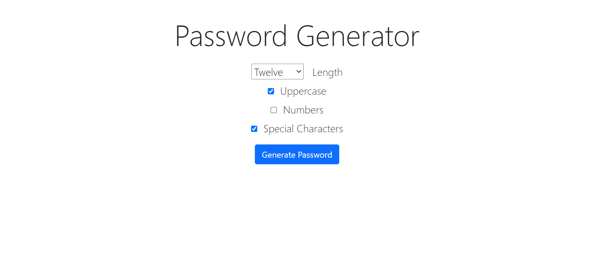

# Password Generator using Django3

Generate a secure, random password based on your liking. It gets automatically copied to your clipboard!

This is a beginner-friendly Django project which (upon some slight modifications)
can also be included for password suggestions in building user authentication systems in Django.
## Tools used
Python, Django, Pyperclip module (Backend) 

BootStrap, HTML-CSS (Frontend)
## Screenshots
Home Page - Select the complexity the password should have:

View and copy generated password to clipboard:

